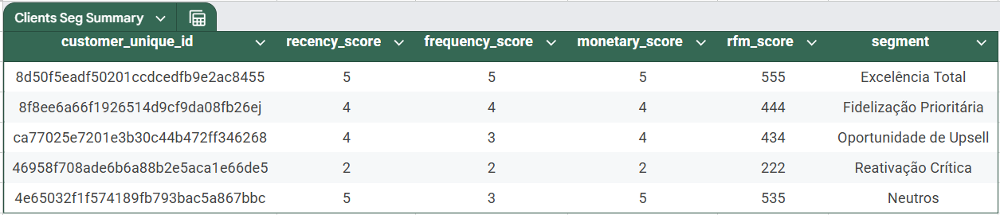

# 🏷️ Segmentação de Clientes RFM - Análise de Comportamento de Compra  

Este projeto aplica a metodologia **RFM (Recência, Frequência, Valor Monetário)** para segmentar clientes de um e-commerce brasileiro, utilizando dados de transações por cartão de crédito. O objetivo é identificar grupos de clientes para estratégias de marketing personalizado.  

**🔗 Base de Dados**: [Brazilian E-Commerce Dataset by Olist](https://www.kaggle.com/datasets/olistbr/brazilian-ecommerce)  

---

## 📌 **Técnica RFM**  
O método RFM classifica clientes com base em:  
- **Recência (R)**: Quantos dias se passaram desde a última compra (quanto menor, melhor).  
- **Frequência (F)**: Número total de compras realizadas.  
- **Valor Monetário (M)**: Soma do valor gasto pelo cliente.  

A segmentação foi feita da seguinte forma:  
1. **Pré-processamento**:  
   - Filtragem de pedidos concluídos pelo método cartão de crédito e filtragem de nulos.  
   - Cálculo da data da última compra e valor total por cliente.  
2. **Cálculo RFM**:  
   - `Recência`: Diferença em dias entre a última compra e a data de análise.  
   - `Frequência`: Número de pedidos por cliente.  
   - `Valor Monetário`: Soma de `payment_value` por cliente.  
3. **Segmentação**:  
   - Divisão em quartis para classificar clientes em grupos (ex.: `1 a 5`, onde 5 é o melhor score).  
   - Combinação de scores RFM para criar segmentos como:  
     - **Excelência Total** (R = 4 ou 5, F = 4 ou 5, M = 5).  
     - **Fidelização Prioritária** (R = 4 ou 5, F = 4 ou 5, M = 4).  
     - **Oportunidade de Upsell** (R = 3 ou 4, F = 3 ou 4 ou 5, M = 3 ou 4).  
     - **Reativação Crítica** (R = 1 ou 2, F = 1 ou 2, M = 1 ou 2).       
     - **Neutros** (Valores de R, F e M não se enquadram nas outras categorias).           

---

## 🛠️ **Tecnologias e Bibliotecas**  
- **Python** (Pandas, NumPy).  
- **Jupyter Notebook** (para análise interativa).  
- **Git/GitHub** (versionamento).  

---

## 📂 **Estrutura do Projeto**  
├── data/
│ ├── olist_customers_dataset.csv # Dados de consumidores.
│ ├── olist_order_payments_dataset.csv # Dados de pagamentos.
│ ├── olist_orders_dataset.csv # Dados de pedidos.
├── clients_seg.xlsx # Excel com o dataframe final do cálculo RFM.
├── main.ipynb # Notebook com toda a análise RFM.
└── README.md # Documentação do projeto.

---

## 🚀 **Como Reproduzir a Análise**  
1. **Execute o Jupyter Notebook**:  
   ```bash
   jupyter notebook main.ipynb
2. **Siga as etapas do notebook**:
   - Carregamento dos dados
   - Pré-processamento (filtrar pedidos, calcular RFM)
   - Visualização (excel de segmentação)


---

### **📊 Resultados**  

Exemplo da tabela exportada para Excel com os scores RFM:  



